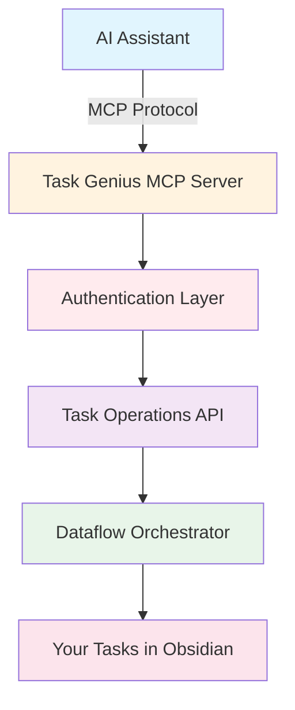

import { VersionCallout } from "@/components/VersionCallout";

# MCP Integration

<VersionCallout version="9.6.0" />

Model Context Protocol (MCP) integration transforms Task Genius into an AI-powered task management powerhouse. This comprehensive guide will walk you through everything you need to know about setting up, configuring, and using MCP with your favorite AI tools.

## What is MCP?

Model Context Protocol (MCP) is an open standard developed by Anthropic that enables secure, standardized communication between AI assistants and external tools. In Task Genius, MCP allows AI assistants to:

- 📊 **Query and analyze** your task data with sophisticated filters
- ✨ **Create and update** tasks with full metadata support
- 🔄 **Batch process** multiple tasks efficiently
- 📈 **Generate insights** from your task patterns
- 🤖 **Automate workflows** based on your preferences

## Why Use MCP with Task Genius?

### Enhanced Productivity

Instead of manually managing tasks, you can now:
- Ask AI to organize your day based on priorities
- Generate task lists from meeting notes
- Automatically categorize and tag tasks
- Create recurring task templates

### Intelligent Task Management

AI can help you:
- Identify overdue tasks and suggest rescheduling
- Find patterns in your productivity
- Recommend task prioritization
- Generate progress reports

### 🔗 Seamless Integration

MCP works with:
- **Claude Desktop** - Anthropic's desktop AI assistant
- **Cursor** - AI-powered code editor
- **Claude Code** - Command-line AI assistant
- **VS Code** - With MCP extensions
- **Windsurf** - AI development environment
- **Zed** - Modern code editor
- **Custom Applications** - Via HTTP API

## Architecture Overview

### Key Components

1. **MCP Server**: Built into Task Genius, runs locally on port 7777
2. **Authentication**: Token-based security with app ID verification
3. **Task API**: Comprehensive CRUD operations for task management
4. **Dataflow Integration**: Direct connection to Task Genius's task system
5. **Real-time Sync**: Changes reflect immediately in Obsidian

## Security Model

Task Genius implements multiple security layers:

### Authentication
- **Bearer Token**: Unique, auto-generated authentication token
- **App ID**: Vault-specific identifier for additional security
- **Combined Auth**: Support for both separate and combined authentication headers

### Access Control
- **Local-only by default**: Server binds to 127.0.0.1
- **Optional network access**: Can be configured for remote access
- **CORS support**: Configurable for web-based clients

### Security Best Practices
1. Never share your authentication token
2. Use local-only mode unless absolutely necessary
3. Regularly regenerate tokens if exposed
4. Monitor server logs for unauthorized access attempts

## Available Operations

Task Genius MCP provides 25+ tools organized into categories:

### Query Operations
- `query_tasks` - Advanced search with filters
- `query_project_tasks` - Get tasks by project
- `query_context_tasks` - Get tasks by context
- `query_by_priority` - Filter by priority level
- `query_by_due_date` - Find tasks in date ranges
- `search_tasks` - Full-text search

### Create Operations
- `create_task` - Create single task
- `create_task_in_daily_note` - Add to today's note
- `batch_create_tasks` - Create multiple tasks
- `batch_create_subtasks` - Add subtasks

### Update Operations
- `update_task` - Modify task properties
- `update_task_status` - Change completion
- `batch_update_task_status` - Bulk status changes
- `postpone_tasks` - Reschedule tasks

### Management Operations
- `list_all_metadata` - Get tags, projects, contexts
- `list_tasks_for_period` - Get tasks by time period
- `delete_task` - Remove tasks

## Quick Start

### Step 1: Enable MCP

<DeepLinkButton href="obsidian://task-genius/settings?tab=mcp-integration&action=enable">
  Enable MCP Server
</DeepLinkButton>

Or manually:
1. Open Obsidian Settings
2. Navigate to Task Genius → MCP Integration
3. Toggle "Enable MCP Server" ON

### Step 2: Note Your Credentials

After enabling, you'll see:
- **Server URL**: `http://127.0.0.1:7777/mcp`
- **Auth Token**: Auto-generated secure token
- **App ID**: Your vault's unique identifier

### Step 3: Configure Your AI Client

Choose your AI tool and follow the specific configuration guide:

<Cards>
  <Card
    title="🖱️ Cursor"
    description="One-click setup with deeplink"
    href="/docs/mcp-integration/clients/cursor"
  />
  <Card
    title="🖥️ Claude Desktop"
    description="Native desktop integration"
    href="/docs/mcp-integration/clients/claude-desktop"
  />
  <Card
    title="⌨️ Claude Code"
    description="Command-line interface"
    href="/docs/mcp-integration/clients/claude-code"
  />
  <Card
    title="📝 VS Code"
    description="Editor integration"
    href="/docs/mcp-integration/clients/vscode"
  />
</Cards>

### Step 4: Test Connection

<DeepLinkButton href="obsidian://task-genius/settings?tab=mcp-integration&action=test" variant="secondary">
  Test MCP Connection
</DeepLinkButton>

## What's Next?

- **[Client Configuration](/docs/mcp-integration/clients)** - Detailed setup for each AI tool
- **[API Reference](/docs/mcp-integration/api-reference)** - Complete tool documentation
- **[Use Cases](/docs/mcp-integration/use-cases)** - Practical examples and workflows
- **[Troubleshooting](/docs/mcp-integration/troubleshooting)** - Common issues and solutions

## System Requirements

- **Obsidian**: Version 0.15.2 or higher
- **Task Genius**: Version 9.0.0 or higher
- **Platform**: Desktop only (Windows, macOS, Linux)
- **Network**: Local network access (configurable)
- **Port**: 7777 (configurable)

## Getting Help

If you encounter issues:

1. Check the [Troubleshooting Guide](/docs/mcp-integration/troubleshooting)
2. Review server logs in Obsidian console (`Ctrl+Shift+I`)
3. Test connection using the built-in tester
4. Join our [Discord community](https://discord.gg/taskgenius)
5. Report bugs on [GitHub](https://github.com/yourusername/task-genius/issues)

<Callout type="info">
  **Pro Tip**: Start with local-only mode and basic queries before exploring advanced features. This helps you understand the system while maintaining security.
</Callout>