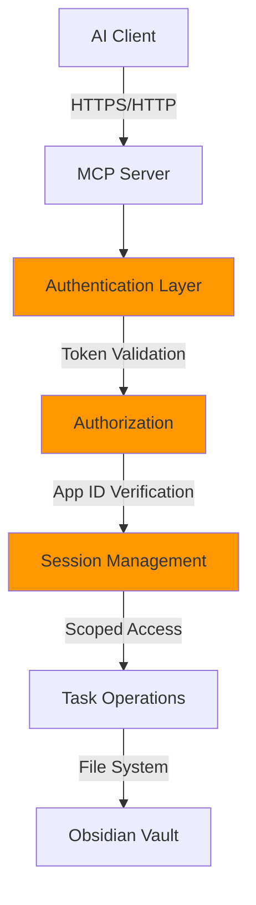

This guide covers security considerations and best practices for using Task Genius MCP integration safely and securely.

## Security Overview

Task Genius MCP implements multiple security layers:



## Authentication & Authorization

### Token Security

**Token Generation:**
- Tokens are cryptographically random (32+ characters)
- Generated using secure random functions
- Unique per vault installation

**Token Storage:**
```javascript
// ✅ Good: Stored in Obsidian's secure settings
{
  "mcpIntegration": {
    "authToken": "encrypted_token_here"
  }
}

// ❌ Bad: Hardcoded in configuration
const TOKEN = "abc123..."; // Never do this
```

**Token Rotation:**

<DeepLinkButton href="obsidian://task-genius/settings?tab=mcp-integration&action=regenerate-token" variant="warning">
  Regenerate Token
</DeepLinkButton>

Rotate tokens:
- Every 90 days (recommended)
- After any suspected compromise
- When changing access patterns
- Before major vault migrations

### App ID Protection

The App ID provides an additional security layer:

```http
Authorization: Bearer TOKEN+APP_ID
```

Benefits:
- Vault-specific identification
- Prevents token reuse across vaults
- Enables audit trails
- Supports multi-vault setups

## Network Security

### Local-Only Mode (Default)

**Configuration:**
```json
{
  "host": "127.0.0.1",  // Local only
  "port": 7777
}
```

**Security benefits:**
- No external network access
- Protected from remote attacks
- No firewall configuration needed
- Ideal for single-user setups

### Network Access Mode

**⚠️ Only enable if necessary:**

```json
{
  "host": "0.0.0.0",  // All interfaces - USE WITH CAUTION
  "port": 7777
}
```

**Required protections:**

1. **Firewall Rules:**
```bash
# Allow only specific IPs
iptables -A INPUT -p tcp --dport 7777 -s 192.168.1.0/24 -j ACCEPT
iptables -A INPUT -p tcp --dport 7777 -j DROP
```

2. **VPN/Tunnel:**
```bash
# Use SSH tunnel instead of direct exposure
ssh -L 7777:localhost:7777 user@remote-host
```

3. **Reverse Proxy with SSL:**
```nginx
server {
    listen 443 ssl;
    ssl_certificate /path/to/cert.pem;
    ssl_certificate_key /path/to/key.pem;
    
    location /mcp {
        proxy_pass http://127.0.0.1:7777;
        proxy_set_header Authorization $http_authorization;
    }
}
```

## Data Protection

### Sensitive Information

**Never expose in tasks:**
- Passwords or API keys
- Personal identification numbers
- Credit card information
- Private keys or certificates
- Medical/financial data

**Use references instead:**
```markdown
<!-- ❌ Bad -->
- [ ] Update database password to "MyS3cr3tP@ss"

<!-- ✅ Good -->
- [ ] Update database password (see vault)
```

### Vault Encryption

**Enable Obsidian vault encryption:**

1. Use encrypted disk/volume:
```bash
# macOS FileVault
sudo fdesetup enable

# Linux LUKS
cryptsetup luksFormat /dev/sdX

# Windows BitLocker
manage-bde -on C:
```

2. Sync with encrypted services:
- Use end-to-end encrypted sync
- Enable 2FA on cloud services
- Avoid public/shared folders

### Backup Security

**Secure backup practices:**

```bash
# Encrypted backup
tar -czf - /path/to/vault | \
  openssl enc -aes-256-cbc -salt -out vault-backup.tar.gz.enc

# Restore
openssl dec -aes-256-cbc -in vault-backup.tar.gz.enc | \
  tar -xzf -
```

## Access Control

### Client Authentication

**Verify client identity:**

```json
{
  "allowedClients": [
    "Claude Desktop",
    "Cursor",
    "Custom App"
  ],
  "requireClientCert": false,  // Future feature
  "ipWhitelist": [
    "127.0.0.1",
    "192.168.1.100"
  ]
}
```

### Rate Limiting

**Prevent abuse:**

```javascript
// Recommended limits
{
  "rateLimits": {
    "requestsPerSecond": 10,
    "requestsPerMinute": 100,
    "maxConcurrent": 5,
    "maxResponseSize": 10485760  // 10MB
  }
}
```

### Session Management

**Session security:**
- Sessions expire after inactivity (default: 1 hour)
- Unique session ID per connection
- Sessions bound to IP address
- No session sharing between clients

## Audit & Monitoring

### Enable Logging

**Set appropriate log level:**

```json
{
  "logLevel": "info",  // For production
  "logFile": "/path/to/mcp-audit.log",
  "logRotation": {
    "maxSize": "10MB",
    "maxFiles": 10
  }
}
```

### Monitor Access Patterns

**Watch for suspicious activity:**

```bash
# Check access logs
grep "401\|403" mcp-audit.log  # Unauthorized attempts
grep "DELETE" mcp-audit.log     # Deletion operations
grep -c "query_tasks" mcp-audit.log | sort -n  # Excessive queries
```

**Alert triggers:**
- Multiple failed authentication attempts
- Unusual query patterns
- Mass deletion requests
- Access from unexpected IPs

### Security Events

**Log security-relevant events:**

```javascript
// Events to monitor
{
  "events": [
    "auth.failed",      // Failed authentication
    "auth.success",     // Successful login
    "token.regenerated", // Token rotation
    "task.deleted",     // Data deletion
    "config.changed",   // Configuration updates
    "server.started",   // Server lifecycle
    "server.stopped"
  ]
}
```

## Secure Configuration Examples

### Development Environment

```json
{
  "mcpIntegration": {
    "enabled": true,
    "host": "127.0.0.1",
    "port": 7777,
    "authToken": "dev_token_only",
    "enableCors": true,
    "logLevel": "debug"
  }
}
```

### Production Environment

```json
{
  "mcpIntegration": {
    "enabled": true,
    "host": "127.0.0.1",
    "port": 7777,
    "authToken": "${MCP_AUTH_TOKEN}",  // From environment
    "enableCors": false,
    "logLevel": "warning",
    "ssl": {
      "enabled": true,
      "cert": "/path/to/cert.pem",
      "key": "/path/to/key.pem"
    }
  }
}
```

### Team Environment

```json
{
  "mcpIntegration": {
    "enabled": true,
    "host": "0.0.0.0",
    "port": 7777,
    "authToken": "${TEAM_MCP_TOKEN}",
    "enableCors": true,
    "ipWhitelist": [
      "192.168.1.0/24",  // Office network
      "10.0.0.0/8"       // VPN range
    ],
    "requireHttps": true,
    "logLevel": "info"
  }
}
```

## Security Checklist

### Initial Setup

- [ ] Generate strong authentication token
- [ ] Store credentials securely
- [ ] Configure local-only access by default
- [ ] Enable appropriate logging
- [ ] Test authentication before use
- [ ] Document security configuration

### Regular Maintenance

- [ ] Rotate tokens quarterly
- [ ] Review access logs monthly
- [ ] Update Task Genius regularly
- [ ] Audit client configurations
- [ ] Test backup/restore procedures
- [ ] Review firewall rules

### Incident Response

If you suspect a security breach:

1. **Immediate Actions:**
   - [ ] Disable MCP server
   - [ ] Regenerate all tokens
   - [ ] Review recent access logs
   - [ ] Check for unauthorized changes

2. **Investigation:**
   - [ ] Identify breach timeline
   - [ ] Determine data accessed
   - [ ] Find attack vector
   - [ ] Document findings

3. **Recovery:**
   - [ ] Restore from secure backup
   - [ ] Implement additional controls
   - [ ] Update security procedures
   - [ ] Notify affected parties if needed

## Common Vulnerabilities

### 1. Token Exposure

**Risk:** Tokens in version control

**Prevention:**
```bash
# .gitignore
*.json
config.json
.env
**/data.json
```

**Detection:**
```bash
# Scan for exposed tokens
git grep -E "Bearer [a-zA-Z0-9+/]{32,}"
```

### 2. Insecure Transport

**Risk:** Token interception on network

**Mitigation:**
- Use HTTPS when possible
- Implement VPN for remote access
- Use SSH tunnels for security
- Never use public WiFi unprotected

### 3. Excessive Permissions

**Risk:** Overly broad access

**Mitigation:**
- Principle of least privilege
- Separate read/write tokens (future)
- Time-based access controls
- Regular permission audits

## Compliance Considerations

### GDPR Compliance

If handling EU personal data:
- Implement data minimization
- Provide data export capabilities
- Enable deletion rights
- Maintain audit logs
- Document data processing

### HIPAA Compliance

For healthcare-related tasks:
- Encrypt data at rest and in transit
- Implement access controls
- Maintain audit trails
- Regular security assessments
- Business Associate Agreements

### SOC 2 Requirements

For enterprise use:
- Document security policies
- Regular vulnerability assessments
- Incident response procedures
- Change management processes
- Third-party audits

## Security Tools

### Testing Tools

```bash
# Test authentication
curl -X POST http://127.0.0.1:7777/mcp \
  -H "Authorization: Bearer INVALID" \
  -d '{"jsonrpc":"2.0","id":1,"method":"initialize"}'
# Should return 401

# Test rate limiting
for i in {1..100}; do
  curl -X POST http://127.0.0.1:7777/health &
done
# Should see rate limit errors

# Port scanning
nmap -p 7777 127.0.0.1
# Should show only expected port
```

### Monitoring Scripts

```bash
#!/bin/bash
# monitor-mcp.sh

# Check for failed auth attempts
FAILURES=$(grep -c "401" /var/log/mcp.log)
if [ $FAILURES -gt 10 ]; then
  echo "Warning: $FAILURES failed auth attempts"
  # Send alert
fi

# Check for unusual activity
DELETES=$(grep -c "delete_task" /var/log/mcp.log)
if [ $DELETES -gt 50 ]; then
  echo "Warning: Unusual deletion activity"
  # Investigate
fi
```

## Recommendations by Use Case

### Personal Use
- Local-only access (127.0.0.1)
- Simple token authentication
- Minimal logging
- Regular backups

### Small Team
- VPN-based access
- Shared token with rotation
- Info-level logging
- Encrypted backups

### Enterprise
- Zero-trust network model
- Certificate-based auth
- Comprehensive audit logging
- Automated security scanning
- Regular penetration testing

## Next Steps

- Review [troubleshooting guide](/docs/mcp-integration/troubleshooting) for security-related issues
- Implement [monitoring and alerting](/docs/mcp-integration/monitoring)
- Join [security discussions](https://discord.gg/taskgenius-security)
- Report security issues privately to security@taskgenius.app

<Callout type="error">
  **Security Report**: If you discover a security vulnerability, please report it privately to security@taskgenius.app. Do not create public issues for security problems.
</Callout>