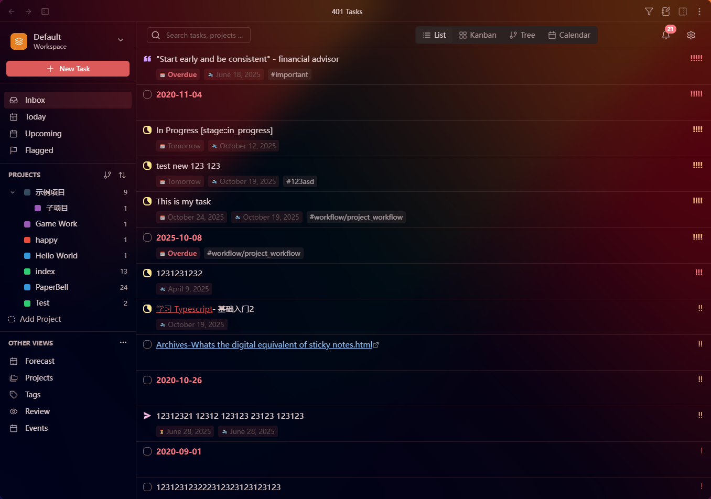

## Shinny new things

- **Fluent Interface**: Brand new modern interface mode

- **Bulk Operations**: Select and manage multiple tasks at once
  - Multi-task Selection: Select multiple tasks with pressing `Shift` key
  - Bulk Operations when you right click on these selected tasks
- **Quick Capture Enhancements**: More powerful task capture
  - Multi-mode Capture: Create tasks or entire files
  - Template Folder Support: Use templates from folders with content merging
  - File Name Template Dropdown: Quick access to common filename patterns
  - Comprehensive Frontmatter: Auto-generate frontmatter for new files
  - Mode Persistence: Remembers your last capture mode
- **Module Visibility Control**: Show/hide modules in fluent interface
- **In-app Changelog Viewer**: View release notes directly in the app with auto-display on updates
- **Enhanced Onboarding**: Guided setup experience
  - Fluent/Legacy Mode Selection: Choose your preferred interface
  - Theme-aware Preview Images: See what each mode looks like
  - Progressive Steps: Step-by-step configuration
  - File Filter Configuration: Set up task sources during onboarding
- **Bases Integration**: Full support Obsidian 1.10.0+
- **Settings Improvements**:
  - Dedicated Interface Settings Tab: Easily switch between Fluent/Legacy modes
  - Tabbed Source Configuration: Better organized index settings
  - Workspace Selector Component: Quickly navigate between workspaces

## Fixes

- **Editor Extensions**: Resolved transaction conflicts between workflow and date managers
- **Workspace**: Improved async handling and error recovery in module visibility
- **Filter**: Fixed proper initialization of filter components
- **Workspace**: Fixed filter state persistence and restoration issues
- **Task Mover**: Prevented archive markers on non-task lines and preserved folded content
- **Settings**: Manage workspace setting now correctly jumps to workspace settings tab
- **Editor**: Improved date positioning in task content (cancel date now goes before task content)
- **Changelog**: Improved cache serialization
- **UI**: Corrected translation interpolation and button alignment

## Improvements

- **State Management**: Improved workspace state management and persistence reliability
- **Code Quality**: Removed void keywords and standardized code formatting
- **Quick Capture**: Consolidated modal imports and improved code quality
- **View Copy**: Enhanced with intelligent two-column preset detection
- **Workflow**: Improved code quality and type safety
- **Performance**: Optimized view initialization and reduced unnecessary renders
- **Search**: Made search query ephemeral across workspace switches
- **License**: Added FSL-1.1-ALv2 license and contributor license agreement
- **Documentation**: Updated with CLA and license information, added PR template
